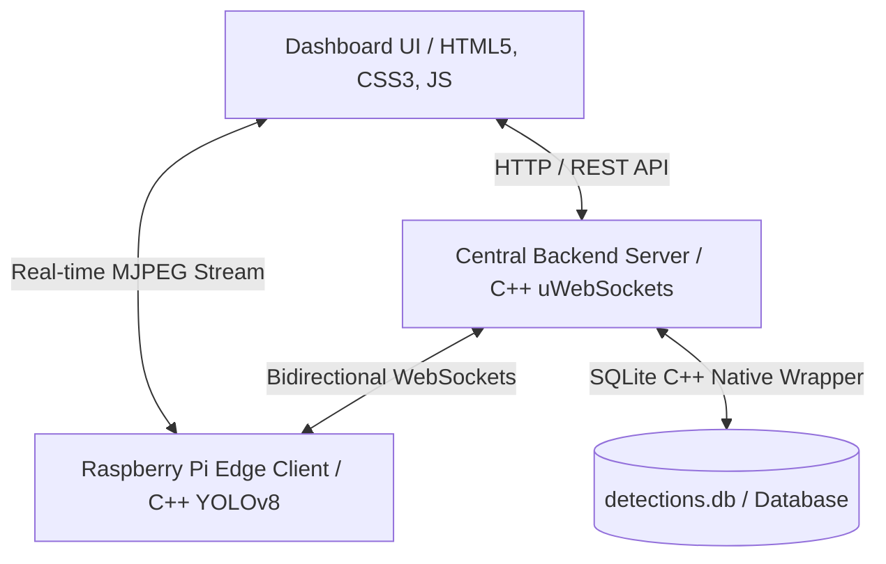

# 🛡️ Hazard Animal Detection Server (`ap_server`)

> **Edge AI 기반 고성능 해충 탐지 및 중앙 모니터링 관리 시스템**
>
> 본 프로젝트는 라즈베리파이 엣지 디바이스(Edge TPU 가속기 탑재)와 중앙 모니터링 서버 간의 실시간 WebSocket 양방향 통신, 고정밀 SQLite 데이터베이스 이벤트 기록, 그리고 미려한 글래스모피즘(Glassmorphism) 스타일의 대시보드 웹 인터페이스를 제공하는 통합 관제 솔루션입니다.

---

## 🏗️ 시스템 아키텍처 (System Architecture)



---

## 🌟 핵심 기능 (Core Features)

### 1. 고성능 C++ 중앙 백엔드 (`backend/`)
* **uWebSockets 엔진 기반**: 초경량, 초고속 비동기 I/O 이벤트 루프 네트워크 프레임워크를 도입하여 수백 대의 엣지 디바이스로부터 쏟아지는 동시 탐지 신호와 대시보드 클라이언트 요청을 지연 없이 실시간 처리합니다.
* **Native C++ SQLite DB 통합 (`DatabaseManager`)**: 이벤트 타임스탬프, 탐지 해충 클래스, 신뢰도(Confidence), 바운딩 박스(Bounding Box) 좌표 및 실시간 검증용 SVG 이미지 스냅샷을 관계형 DB에 영구 저장합니다.
* **실시간 탐지 타겟 필터링**: 개별 카메라 채널별로 감지할 대상(쥐, 바퀴벌레 등)을 백엔드 서버 수준에서 원천 차단(Discard)하여 가비지 데이터 생성을 미연에 방지합니다.

### 2. 프리미엄 반응형 웹 관제 대시보드 (`frontend/`)
* **현대적인 글래스모피즘 다크 모드**: 미려한 네온 컬러 그라데이션, 미세한 호버 인터랙션, 반응형 레이아웃을 통해 직관적이고 프리미엄한 사용자 관제 경험(UX)을 선사합니다.
* **실시간 디바이스 상태 그리드**: 연결된 엣지 컴퓨터의 IP, OS 환경, 가용 대역폭, 물리 카메라 개수 및 핑(Ping) 테스트 통계를 한눈에 확인합니다.
* **하이브리드 비디오 플레이어**: 카메라 전원이 켜졌을 때는 **엣지 장비의 실제 렌즈가 촬영 중인 100% 라이브 영상 스트림**을 즉시 연결하고, 전원이 꺼지면 DB에 기록된 **가장 최근의 증적 기록 스냅샷**을 보여주는 하이브리드 UX를 지원합니다.

### 3. 고정밀 기기/필터링 제어 프로토콜
* **양방향 동기화 하드웨어 전원 토글**: 브라우저에서 전원을 끄는 즉시 양방향 WebSocket 패킷이 전송되어 라즈베리파이 공유 메모리 파일(`/dev/shm/camera_cmd.txt`)을 업데이트하고, 물리 카메라 전원을 OFF하여 Edge TPU 추론 연산을 100% 완전 정지(CPU 점유율 0%)시킵니다.
* **개별 채널 멀티 스트리밍**: 2개 이상의 카메라(CSI 및 USB 카메라) 피드가 엉키지 않도록 고유 파라미터(`?cam=0`, `?cam=1`)를 지원하는 지능형 MJPEG 라우터를 탑재했습니다.

---

## 📂 프로젝트 구조 (Directory Structure)

```text
ap_server/
├── backend/                  # 고성능 C++ 백엔드 소스코드
│   ├── include/              # 헤더 파일 (.h)
│   │   ├── DatabaseManager.h # SQLite DB 제어 래퍼 클래스
│   │   ├── DetectionGateway.h# uWebSockets 라우팅 및 웹소켓 게이트웨이
│   │   └── DetectionService.h# 인메모리 기기 정보 및 비즈니스 로직
│   ├── src/                  # 구현 파일 (.cpp)
│   │   ├── DatabaseManager.cpp
│   │   ├── DetectionGateway.cpp
│   │   ├── DetectionService.cpp
│   │   └── main.cpp          # 메인 서버 진입점 (포트 8081 가동)
│   └── CMakeLists.txt        # CMake 빌드 설정 파일
├── frontend/                 # 프리미엄 관제 대시보드 웹 소스
│   ├── index.html            # 메인 대시보드 홈
│   ├── device.html           # 기기별 세부 설정 화면
│   ├── camera.html           # 카메라별 실시간 렌더링 상세 화면
│   ├── app.js                # 메인 UI 상태 및 신규 기기 등록 모달 처리 JS
│   ├── device.js             # 카메라 카드 목록 및 주간 통계 차트 JS
│   ├── camera.js             # 하이브리드 플레이어 및 타겟 필터 동기화 JS
│   └── style.css             # 글래스모피즘 통합 디자인 스타일시트
├── detections.db             # 로컬 SQLite 데이터베이스 파일 (이벤트 영구 저장)
└── README.md                 # 프로젝트 기술 문서
```

---

## 🛠️ 빌드 및 실행 방법 (Build & Installation)

### 1. 사전 요구사항 (Prerequisites)
본 시스템은 C++17 표준을 준수하며 다음 종속성 라이브러리가 필요합니다:
* **C++ 컴파일러** (GCC 9+ 또는 Clang)
* **CMake** (3.15 이상)
* **uWebSockets** 및 **uSockets** (네트워크 엔진)
* **SQLite3 Development 라이브러리** (`libsqlite3-dev`)
* **nlohmann/json** (Modern JSON for C++)

### 2. 백엔드 빌드 (WSL 또는 Linux 환경)
```bash
# 1. backend 디렉토리로 이동 및 빌드 폴더 생성
cd ap_server/backend
mkdir -p build && cd build

# 2. CMake 빌드 수행
cmake ..
make -j$(nproc)
```

### 3. 백엔드 서버 가동
```bash
# 빌드 디렉토리 안에서 실행 파일 기동
./DetectionServer
```
* 서버가 성공적으로 켜지면 `http://localhost:8081` 포트에서 HTTP REST API 및 웹소켓 엔드포인트(`/detection`)가 대기 모드로 기동됩니다.

### 4. 프론트엔드 대시보드 실행
* `frontend/index.html` 파일을 웹 브라우저로 직접 더블 클릭하여 실행하거나, 가벼운 정적 웹 서버(예: `Live Server`, `python3 -m http.server`)를 통해 호스팅하여 자유롭게 접속할 수 있습니다.

---

## 📡 주요 API 엔드포인트 (REST APIs)

| HTTP Method | Endpoint | Description |
| :--- | :--- | :--- |
| **GET** | `/logs` | DB에 저장된 전체 해충 감지 기록 데이터베이스 조회 (JSON 배열) |
| **GET** | `/devices` | 등록된 엣지 기기 목록 및 연결된 카메라, 활성 필터 설정 조회 |
| **POST** | `/devices` | 신규 라즈베리파이 엣지 디바이스 동적 등록 |
| **GET** | `/devices/ping/:ip` | 지정된 IP를 사용하는 라즈베리파이의 웹소켓 연결 활성화 여부 실시간 확인 |
| **POST** | `/camera/control` | 웹소켓을 통한 엣지 디바이스 카메라 전원 원격 켜기/끄기 명령 전송 |
| **POST** | `/camera/targets` | 카메라별 실시간 감지 대상 필터(쥐, 바퀴벌레) 서버사이드 설정 업데이트 |

---

## 🌟 프로젝트 특징 요약
본 프로젝트는 **자원 제약이 극심한 라즈베리파이(Edge)의 컴퓨팅 연산을 100% 헤드리스(Headless)로 최적화**하는 한편, **비동기식 C++ uWebSockets와 SQLite 데이터 저장소**를 결합하여 임베디드 AI 제어에 최적화된 엔터프라이즈급 실시간 반응 아키텍처를 실현했습니다. 

추가 문의 사항 및 기술 협조는 pair-programming 세션으로 언제든 요청해 주세요! 🚀
